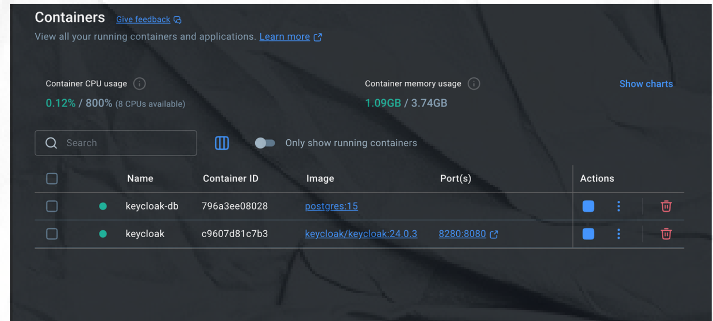
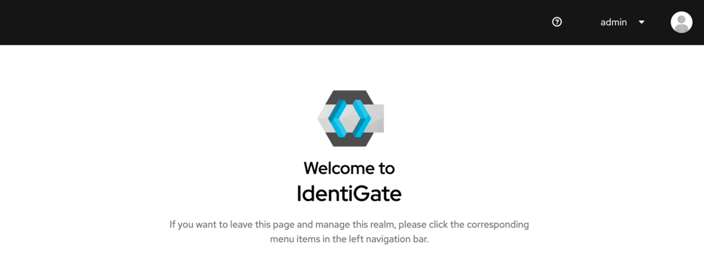
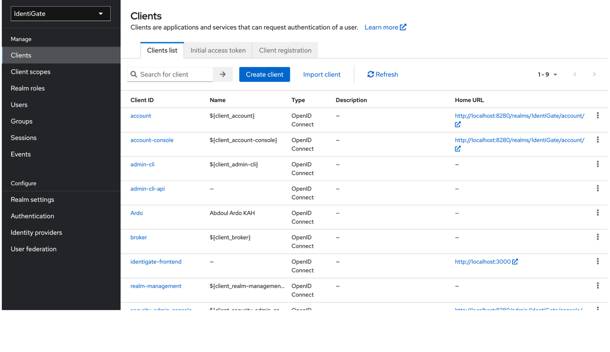
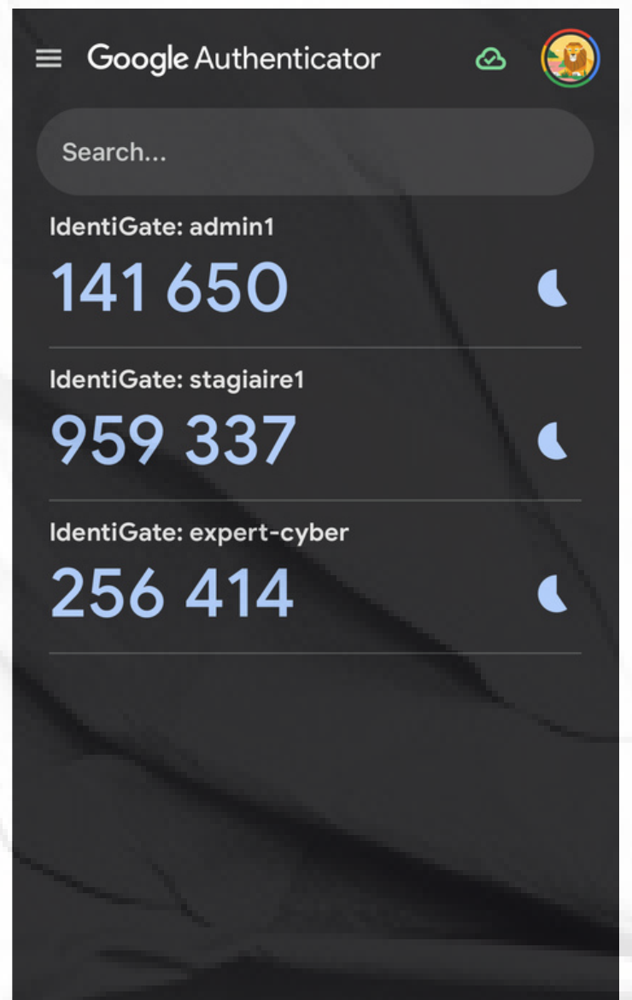
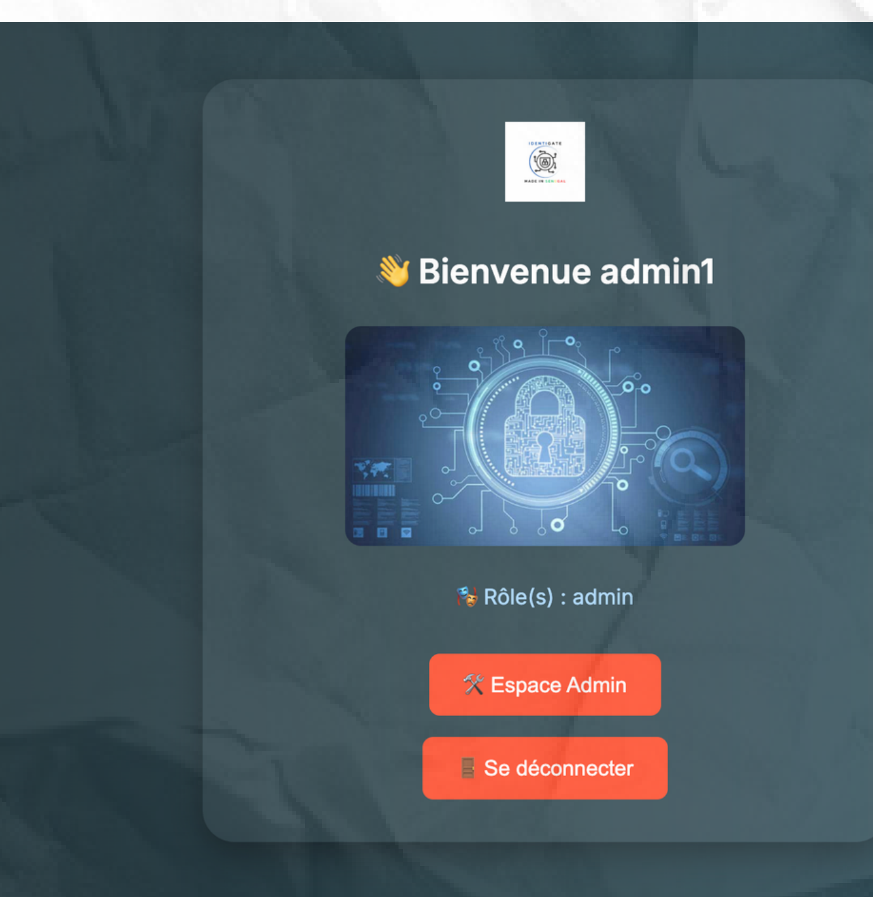
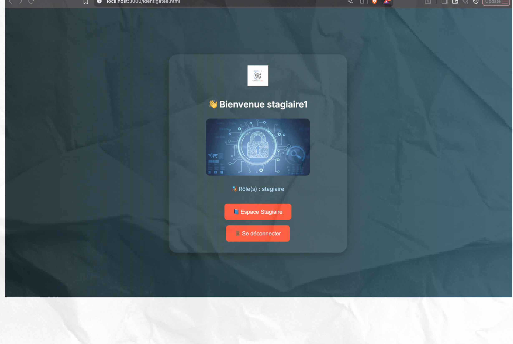

# 🔐 IdentiGate — Gestion des Identités et des Accès avec Keycloak

Étude comparative des solutions IAM (Identity and Access Management) et mise en œuvre d'une architecture d'authentification centralisée, sécurisée et automatisée, construite autour de **Keycloak**.

> Projet réalisé dans le cadre du BTS Cybersécurité — École Centrale Polytechnique d'Ingénieurs (ECPI), Dakar — Juillet 2025.

  

---

## 🎯 Contexte

Avec la multiplication des utilisateurs, des applications et des accès distants, garantir que seules les bonnes personnes accèdent aux bonnes ressources, au bon moment, est devenu un enjeu central de la cybersécurité.

**IdentiGate** répond à ce besoin en proposant une solution IAM open source permettant :
- l'authentification centralisée,
- le contrôle des rôles (RBAC),
- le provisionnement automatisé des utilisateurs,
- l'authentification forte (2FA / OTP).

## 🤔 Pourquoi Keycloak ?

Une étude comparative a été menée entre solutions commerciales (Azure AD, Okta, IBM Security Identity Manager) et solutions open source (Keycloak, Gluu, OpenIAM). Keycloak a été retenu pour :

- être **gratuit et open source**, avec une interface d'administration complète
- son support natif du **SSO** et du **2FA**
- son **API REST** puissante pour l'intégration avec d'autres systèmes
- sa compatibilité **Docker / Kubernetes**
- son support des protocoles standards **OpenID Connect, OAuth 2.0, SAML 2.0**

## 🏗️ Architecture

L'infrastructure repose sur deux conteneurs Docker :
- **Keycloak** : le serveur d'authentification
- **PostgreSQL** : la base de données de configuration et d'identités



Un realm dédié `IdentiGate` a été créé, avec plusieurs clients OpenID Connect (dont `admin-cli-api` pour l'administration via API et `Ardo` pour simuler un client applicatif).




## ⚙️ Provisionnement automatisé des utilisateurs

Le script [`scripts/provision-users.sh`](scripts/provision-users.sh) crée automatiquement les comptes utilisateurs via l'API REST de Keycloak, sans passer par l'interface d'administration :

```bash
USERS=(
  "stagiaire1;stagiaire1@example.com;stagiaire123;user"
  "expert-cyber;cyber@example.com;expert2024;admin"
  "partenaire-x;partner@example.com;partenaire123;partenaire"
)
```

## 🛡️ Authentification forte (2FA / OTP)

Chaque utilisateur active une authentification à deux facteurs via **Google Authenticator** : un QR code est scanné lors de la première connexion, puis un code à usage unique (OTP) est requis à chaque connexion suivante.



## 👥 Gestion des rôles (RBAC)

Trois rôles personnalisés structurent les accès :

| Rôle | Description |
|---|---|
| `admin` | Tous les privilèges d'administration |
| `partenaire` | Utilisateur externe ou collaborateur |
| `user` | Profil standard, droits limités |

Le script [`scripts/assign-roles.sh`](scripts/assign-roles.sh) assigne automatiquement le rôle approprié à chaque utilisateur via l'API REST.

## 🔗 Single Sign-On (SSO)

Deux applications web (`IdentiGate.html` et `expert.html`) ont été sécurisées avec **Keycloak.js**, la bibliothèque cliente officielle :
- **Connexion centralisée** : une fois connecté sur une application, l'utilisateur accède à l'autre sans se reconnecter
- **Déconnexion synchronisée** : se déconnecter d'une interface termine la session sur toutes les applications protégées

L'interface s'adapte dynamiquement selon le rôle de l'utilisateur connecté :

<p float="left">
  
  
</p>

## 📦 Export & Tests

La configuration complète du realm (clients, utilisateurs, rôles) a été exportée au format JSON pour être versionnée et réutilisable sur un autre environnement.

Des scénarios de test ont validé la cohérence du modèle de rôles : un compte `user` ne peut pas accéder aux fonctionnalités réservées à l'administration, tandis qu'un compte `admin` dispose d'un accès complet.

## 🧰 Stack technique

`Docker` · `Keycloak` · `PostgreSQL` · `Bash` · `Keycloak REST API` · `Keycloak.js` · `HTML / JavaScript` · `OpenID Connect` · `OAuth 2.0`

## 🚀 Pistes d'évolution

- Intégration d'un annuaire **LDAP** pour la fédération d'identités
- Connecteurs externes pour élargir l'interopérabilité du realm

## 📄 Documentation complète

La présentation détaillée du projet (architecture, choix techniques, démonstration pas à pas) est disponible dans [`docs/`](docs/).

---

**Auteur** : Abdoul Ardo KAH — Étudiant Ingénieur IA & Cybersécurité, ESIEE Paris
📧 abdoulardokah@gmail.com
